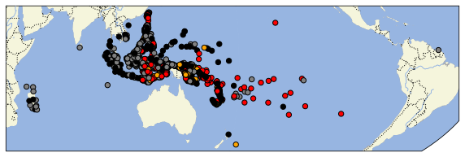
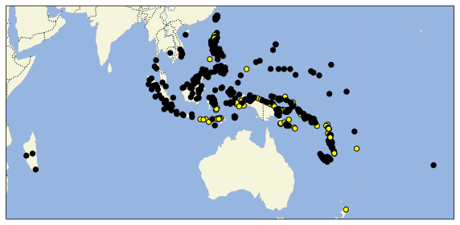
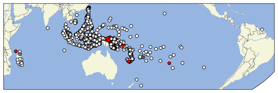
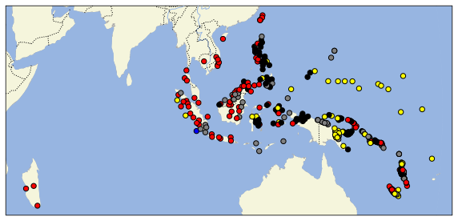
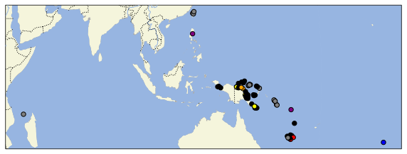

# Maps

## Is there colexification?

&nbsp; | Description | Count
--- | --- | ---:
$${\color{black}⏺}$$ | lexically distinct | 465
$${\color{gray}⏺}$$ | unknown | 462
$${\color{red}⏺}$$ | full colexification | 194
$${\color{orange}⏺}$$ | partial colexification | 153
&nbsp; | &nbsp; | **1274**

View [interactive map](https://raw.githubusercontent.com/cldf-datasets/barlowhandandfive/refs/heads/main/maps/colex.html).

## Is distinctness due to lexical replacement or phonological change?

&nbsp; | Description | Count
--- | --- | ---:
$${\color{black}⏺}$$ | lexical replacement | 380
$${\color{yellow}⏺}$$ | phonological change | 85
&nbsp; | &nbsp; | **465**

View [interactive map](https://raw.githubusercontent.com/cldf-datasets/barlowhandandfive/refs/heads/main/maps/dist.html).

## Was there lexical replacement of hand?

&nbsp; | Description | Count
--- | --- | ---:
$${\color{white}⏺}$$ | no | 428
$${\color{red}⏺}$$ | yes | 390
$${\color{gray}⏺}$$ | unknown | 456
&nbsp; | &nbsp; | **1274**

View [interactive map](https://raw.githubusercontent.com/cldf-datasets/barlowhandandfive/refs/heads/main/maps/repl_hand.html).

## Was there lexical replacement of five?

&nbsp; | Description | Count
--- | --- | ---:
$${\color{white}⏺}$$ | no | 1121
$${\color{red}⏺}$$ | yes | 84
$${\color{gray}⏺}$$ | unknown | 69
&nbsp; | &nbsp; | **1274**

View [interactive map](https://raw.githubusercontent.com/cldf-datasets/barlowhandandfive/refs/heads/main/maps/repl_five.html).

## What replaced hand?

&nbsp; | Description | Count
--- | --- | ---:
$${\color{black}⏺}$$ | “hand” word other than *qalima | 139
$${\color{red}⏺}$$ | part of the arm | 109
$${\color{gray}⏺}$$ | unclear | 72
$${\color{yellow}⏺}$$ | wing | 69
$${\color{blue}⏺}$$ | ‘hold onto’ | 1
&nbsp; | &nbsp; | **390**

View [interactive map](https://raw.githubusercontent.com/cldf-datasets/barlowhandandfive/refs/heads/main/maps/hand_replacement.html).

## What replaced five?

&nbsp; | Description | Count
--- | --- | ---:
$${\color{black}⏺}$$ | “hand” word other than *qalima | 45
$${\color{gray}⏺}$$ | unclear | 20
$${\color{yellow}⏺}$$ | addition with 2 | 8
$${\color{red}⏺}$$ | tally word | 6
$${\color{purple}⏺}$$ | ‘count’ | 2
$${\color{orange}⏺}$$ | addition with 4 | 2
$${\color{blue}⏺}$$ | ‘part’ | 1
&nbsp; | &nbsp; | **84**

View [interactive map](https://raw.githubusercontent.com/cldf-datasets/barlowhandandfive/refs/heads/main/maps/five_replacement.html).
